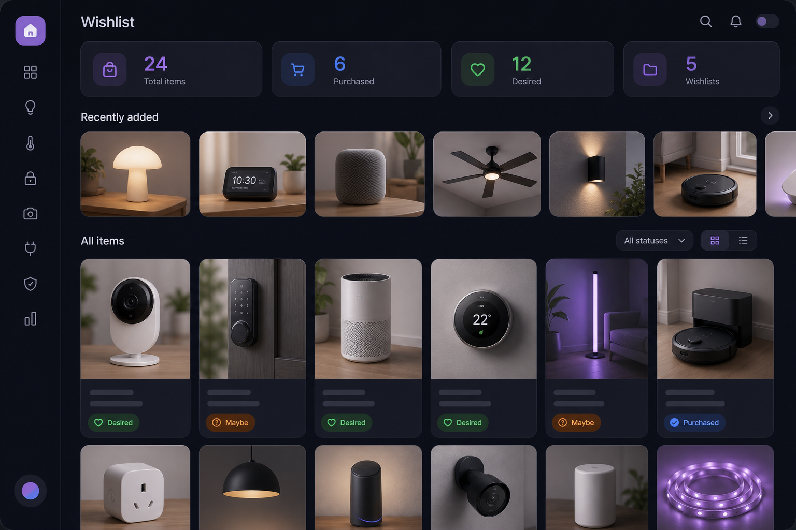
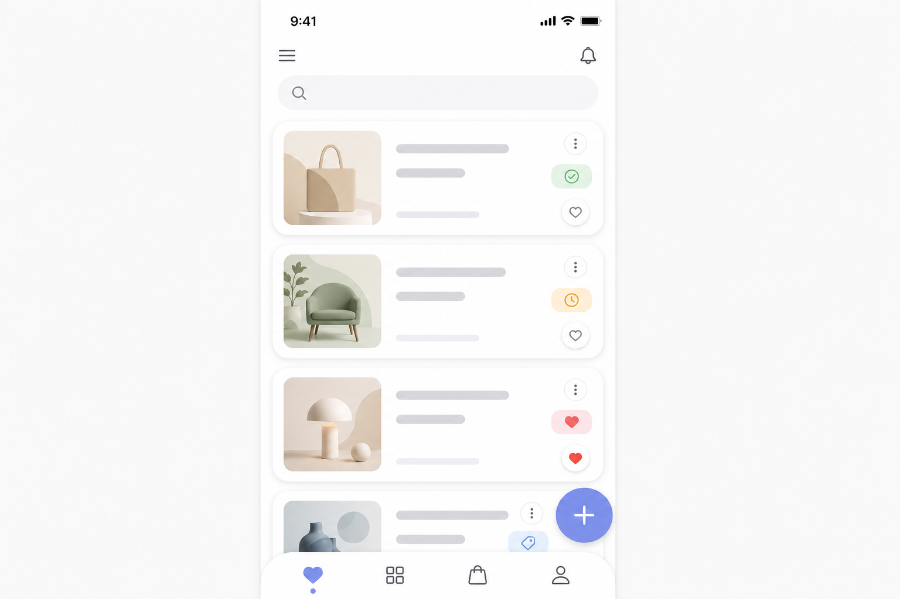

# Wishlist Manager for Home Assistant

**Current version: 1.3.0** (see `manifest.json` and `INTEGRATION_VERSION` in `const.py`).

[](https://github.com/hacs/integration)

Production-oriented custom integration and sidebar panel to manage **multiple wishlists** with rich items (title, description, image URL or **uploaded image**, external link, notes, status, price, tags, favorites, archive), **drag-and-drop** ordering, **REST + WebSocket APIs**, **automations** (sensors, services, events), and optional **public share links**.



## Features

- **Wishlists**: create, rename, delete, reorder, icon/color metadata, share token for read-only JSON.
- **Items**: desired / maybe / purchased, **image URL or file upload** (JPEG/PNG/GIF/WebP, max 5 MB → `config/www/wishlist_manager/`, URL `/local/wishlist_manager/…`), product link, notes, price, tags, favorite, archived.
- **UI** (Lit + Home Assistant theme variables): responsive grid, filters (status, list, search), sorting (newest, oldest, A–Z, status), recent strip, modal editor, “fill from link” metadata scrape.
- **Backend**: Config flow, `.storage` persistence, WebSocket commands, REST routes, typed Python models.
- **Home Assistant**: statistic sensors, documented services, bus events for automations.

## Translations (multi-language)

Home Assistant picks strings from the signed-in **user profile language** (Settings → Profile → Language). The integration ships:

- `translations/en.json` — full strings (config flow, entities, services, **panel** UI).
- `translations/de.json` — example German (title, config, entity names, panel). Add more files using the same structure, e.g. `es.json`, `fr.json`, `pt-BR.json` (locale codes must match Home Assistant).

**Backend** (config flow, sensors, services) uses the standard `translations/*.json` tree automatically.

**Sidebar panel** (Lit) resolves labels with `hass.localize("component.wishlist_manager.panel.<key>")` via `frontend/src/i18n.ts`. Rebuild after editing strings: `cd frontend && npm run build`.

## Requirements

- Home Assistant **2024.6** or newer (uses `StaticPathConfig`, `SupportsResponse`, modern HTTP stack).

## Installation (HACS)

1. Open **HACS → Integrations → ⋮ → Custom repositories**.
2. Add this repository URL, category **Integration**.
3. Install **Wishlist Manager** and restart Home Assistant.
4. Go to **Settings → Devices & services → Add integration → Wishlist Manager**.

The sidebar entry **Wishlist Manager** (gift icon) opens the panel. The frontend bundle is served from the integration’s `www/` folder automatically.

### Manual install

Copy `custom_components/wishlist_manager/` into your Home Assistant `config/custom_components/` directory, restart, then add the integration as above.

### Rebuilding the frontend (optional)

```bash
cd frontend
npm install
npm run build
```

Output is written to `custom_components/wishlist_manager/www/wishlist-manager-panel.js`.

## Configuration

No `configuration.yaml` block is required. Optional Lovelace example: [`examples/lovelace_example.yaml`](examples/lovelace_example.yaml).

## Sensors

| Entity (example) | Description |
|------------------|-------------|
| `sensor.wishlist_manager_total_items` | Count of all items (including archived). See `stats.archived_items` in the REST/WebSocket snapshot. |
| `sensor.wishlist_manager_purchased_items` | Items with status **purchased**. |
| `sensor.wishlist_manager_desired_items` | Status **desired**. |
| `sensor.wishlist_manager_maybe_items` | Status **maybe**. |
| `sensor.wishlist_manager_wishlist_count` | Number of lists. |
| `sensor.wishlist_manager_favorite_items` | Favorite flag count. |

Exact `entity_id` values may include your config entry slug; pick entities from **Developer tools → States** if names differ.

## Services

| Service | Purpose |
|---------|---------|
| `wishlist_manager.add_item` | Add an item (returns created item). |
| `wishlist_manager.update_item` | Patch fields by `wishlist_id` + `item_id`. |
| `wishlist_manager.remove_item` | Delete an item. |
| `wishlist_manager.set_status` | Set **desired** / **maybe** / **purchased**. |
| `wishlist_manager.create_wishlist` | Create a list. |
| `wishlist_manager.update_wishlist` | Rename / update icon / color. |
| `wishlist_manager.delete_wishlist` | Delete a list and all items. |
| `wishlist_manager.fetch_metadata` | Scrape Open Graph / title from a URL. |

See `custom_components/wishlist_manager/services.yaml` for fields.

## Events

- `wishlist_manager_item_added`
- `wishlist_manager_item_updated`
- `wishlist_manager_item_removed`
- `wishlist_manager_item_purchased`
- `wishlist_manager_wishlist_created`
- `wishlist_manager_wishlist_updated`
- `wishlist_manager_wishlist_removed`

Event payloads include `wishlist_id`, `item_id`, and `title` where applicable.

## REST API

Authenticated (Home Assistant login session or long-lived token):

- `GET/POST /api/wishlist_manager/wishlists`
- `POST /api/wishlist_manager/wishlists/reorder` — body `{"wishlist_ids":["..."]}`
- `GET/PATCH/DELETE /api/wishlist_manager/wishlists/{wishlist_id}`
- `GET/POST /api/wishlist_manager/wishlists/{wishlist_id}/items`
- `POST /api/wishlist_manager/wishlists/{wishlist_id}/items/reorder` — body `{"item_ids":["..."]}`
- `PATCH/DELETE /api/wishlist_manager/wishlists/{wishlist_id}/items/{item_id}`
- `GET /api/wishlist_manager/metadata?url=https://...`
- `POST /api/wishlist_manager/upload_image` — `multipart/form-data` field **`file`** (admin only). Response: `{"image_url":"/local/wishlist_manager/<id>.<ext>"}`.

**Public** (no auth): `GET /api/wishlist_manager/public/{share_token}` returns a redacted snapshot. Generate a token from the panel (**Share link** on a wishlist chip) or via WebSocket `wishlist_manager/wishlists/regenerate_share`. Images stored as `/local/…` usually require a logged-in session to view in a browser; anonymous viewers of the public JSON may not see those thumbnails unless the file is otherwise world-readable (same as normal Home Assistant `/local/` behavior).

## WebSocket API

Types are namespaced, for example:

- `wishlist_manager/wishlists/list`
- `wishlist_manager/items/create`
- `wishlist_manager/metadata/fetch`

Mutating commands require **admin** privileges (matching Home Assistant conventions). Listing is allowed for any authenticated user.

## Storage

Data file: `.storage/wishlist_manager` (JSON, managed through `Store`).

## Screenshots



## License

MIT — see [LICENSE](LICENSE) if present in the repository root.

## Disclaimer

URL metadata fetching downloads third-party pages; use only with hosts you trust. Public share links expose wishlist item data to anyone with the token — treat tokens like passwords.
